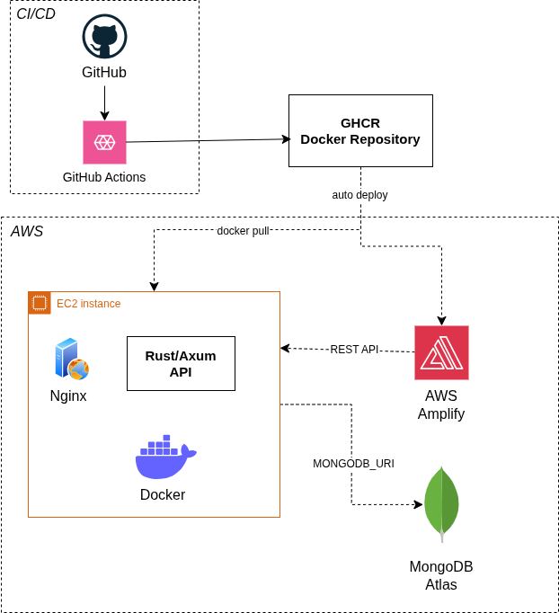

# Notes App - Full-Stack Cloud Deployment

## Overview
This project is a full-stack web application designed for notes management. Developed as part of a Cloud Computing module, the application enforces a strict separation between the frontend and backend and allows users to perform standard CRUD (Create, Read, Update, Delete) operations on their data. 

## Cloud Architecture

Below is the high-level architecture of the application's cloud deployment and CI/CD pipeline:

### Infrastructure Breakdown

* **Frontend (UI):** The user interface is deployed and hosted on **AWS Amplify**, providing a highly available and globally distributed frontend.
* **Backend (API):** The backend is a REST API built with **Rust and Axum**. It is containerized using Docker and deployed on an **AWS EC2 instance**. An **Nginx** server acts as a reverse proxy to route incoming traffic to the API container.
* **Database:** The application uses **MongoDB Atlas**, a fully managed cloud database, securely connected to the backend via a `MONGODB_URI` environment variable.
* **CI/CD Pipeline:** Continuous Integration and Deployment are handled via **GitHub Actions**. Upon code changes, a pipeline automatically builds the backend Docker image and pushes it to the **GitHub Container Registry (GHCR)**. The EC2 instance then pulls the latest image to update the deployment.
